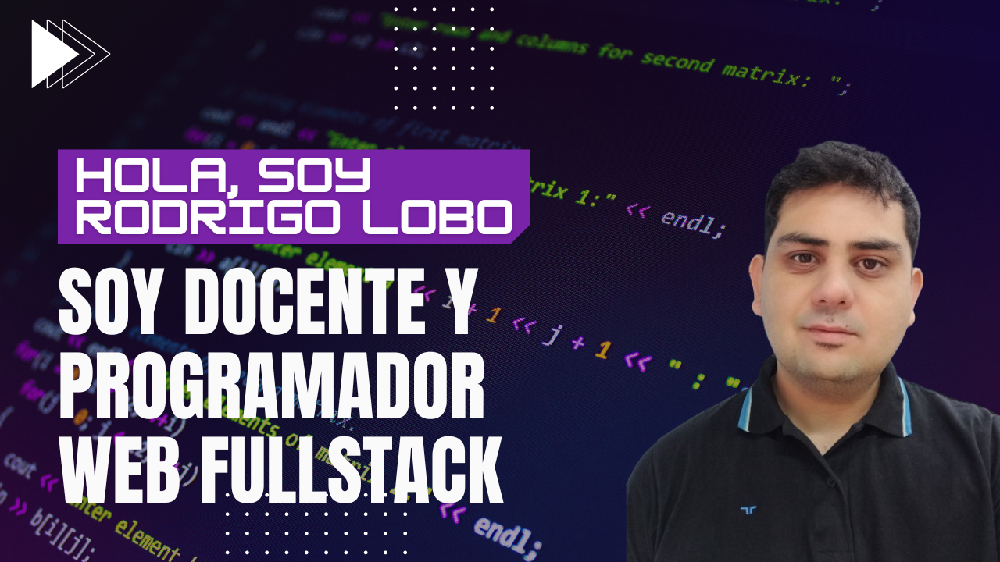

<!-- Banner -->

# 👋 ¡Hola a todos! Soy [RodrigoLoboDev]

Soy **Docente** y **Programador Web FullStack** apasionado por la enseñanza y el desarrollo de aplicaciones web. Trabajo con tecnologías modernas como **React**, **TypeScript** y **Node.js** entre otras tecnologias, para crear soluciones eficientes y escalables.

## 🧑‍💻 Sobre mí

- 🎓 **Docente**: Disfruto compartir mis conocimientos en programación y tecnología con mis alumnos.
- 💻 **Desarrollador Fullstack**: Trabajo tanto en el frontend como en el backend, con experiencia en los stacks **PERN** y **MERN**.
- 📚 **Aprendiz eterno**: Siempre estoy buscando aprender nuevas tecnologías y mejorar mis habilidades.

## 🛠️ Tecnologías y Herramientas

- **Frontend**: React, Tailwind CSS, JavaScript, TypeScript
- **Backend**: Node.js, Express, PostgreSQL, MongoDB
- **DevOps**: Git, GitHub, Docker
- **Otros**: Python, PHP, MySql

## 📈 Estadísticas de GitHub

## 🌍 Conectemos

- 📧 **Email**: [rolobo2812@gmail.com](mailto:rolobo2812@gmail.com)
- 💼 **LinkedIn**: [https://www.linkedin.com/in/jes%C3%BAs-luis-rodrigo-lobo-6594a81b4/](https://www.linkedin.com/in/jes%C3%BAs-luis-rodrigo-lobo-6594a81b4/)
- 🌐 **WebSite**: [https://portafolio-rodrigo-lobo-dev.vercel.app/](https://portafolio-rodrigo-lobo-dev.vercel.app/)

---

⭐️ **Si te gusta lo que hago, no dudes en seguirme y contribuir a mis proyectos.**
